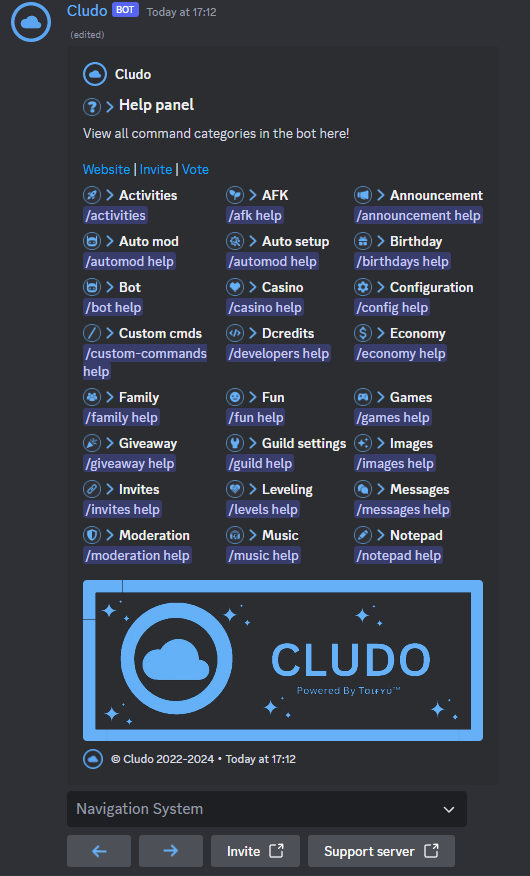

<!-- PROJECT LOGO -->
<br />
<p align="center">
  <a href="https://github.com/zZyreXx/Cludo">
    
  </a>

  <h3 align="center">Cludo</h3>

  <p align="center">
    Cludo is an updated version of <a href="https://github.com/DotwoodMedia/Dbot">Cludo</a>, an advanced Discord multipurpose bot containing more than 400 commands.<br> It can do Moderation, Tickets, Radio, Games, Giveaways, Customisation, Economy, Leveling, Invites, Messages, Utilities, Suggestions, Server Stats etc.<br> Unfortunately the owners stopped at the peak and decided to put the source online of which I made an updated version.
    <br />
    <br />
    <a href="https://github.com/zZyreXx/Cludo/issues">Report Bug</a>
    ·
    <a href="https://github.com/zZyreXx/Cludo/issues">Request Feature</a>
  </p>
</p>

<!-- NOTICE -->

###  》Notice 
> You may not claim this as your own! The original source was created by [Dotwood Media](https://github.com/DotwoodMedia) and [Graphix Development](https://github.com/GraphixDevelopment). The source is modified and updated by me(zZyreXx)

> Discord-Bot is a multipurpose Discord bot base in [Discord.js](https://github.com/Discordjs/discordjs)
If you like this repository, feel free to leave a star ⭐ to motivate me!

<!-- ABOUT THE PROJECT -->

## 》Feature
- [x] Slash Commands 
- [x] Upto date with Discord.js v14
- [x] Automod
- [x] Custom Commands
- [x] Music Commands
- [x] Tickets
- [x] Utility Commands
- [x] Suggestions 
- [x] Reaction Roles
- [x] Family
- [x] Giveaways 
- [x] Easy to use
- [x] Customizable
- [x] And much more
- [x] Don't wanna host it yourself? [Use our public bot](https://discord.com/api/oauth2/authorize?client_id=1071766414358216788&permissions=8&scope=applications.commands+bot)
## 》Screenshots
<br />
<p align="center">
  <a href="https://github.com/zZyreXx/Cludo">
    
  </a>
</p>

## 》Requirements
- NodeJs v17+
- Java v13 for lavalink server.
- Discord Token. Get it from [Discord Developers Portal](https://discord.com/developers/applications)
- Mongo Database URL. Get it from [MongoDB](https://cloud.mongodb.com/v2/635277bf9f5c7b5620db28a4#clusters)
- Giphy API Token. Get it from [Giphy Developers Portal](https://developers.giphy.com/)
- OpenAI API Key `for ai chatbot`. Get it from [OpenAi Developers Portal](https://beta.openai.com/account/api-keys)
- ClientID `for loading slash commands.` [Discord Developers Portal](https://discord.com/developers/applications)
- Spotify client ID `for Spotify support` [Click here to get](https://developer.spotify.com/dashboard/login)
- Spotify client Secret `for Spotify support` [Click here to get](https://developer.spotify.com/dashboard/login)

## 》Installation Guide

###  Installing via [NPM](https://www.npmjs.com/)
Clone the repo by running
```bash
git clone https://github.com/zZyreXx/Cludo.git
```
### After cloning Fill all requirement in `.env` **(rename `.env.example` to `.env`)**, then run

```bash
npm install
```
To start your bot 

```js
node src/index.js
```

## 》Support Server
[](https://discord.gg/gJc5CBCC6w)

[Support Server](https://discord.gg/vVwndu9VuC) - Discord-Bot's Support Server Invite

# 》Faq
> How to get access to Developers Commands? You will have to set them up via MongoDB or run the below command.

```bash
npm run add-dev YOUR_Discord_ID
```
